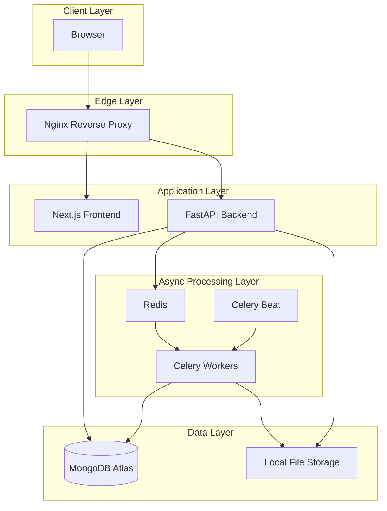
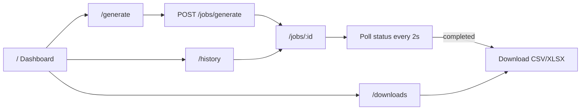
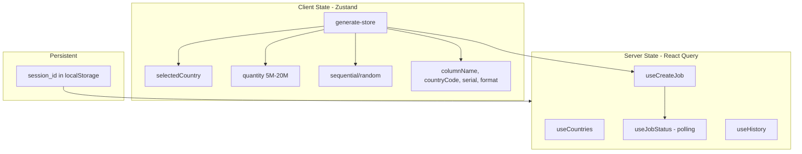
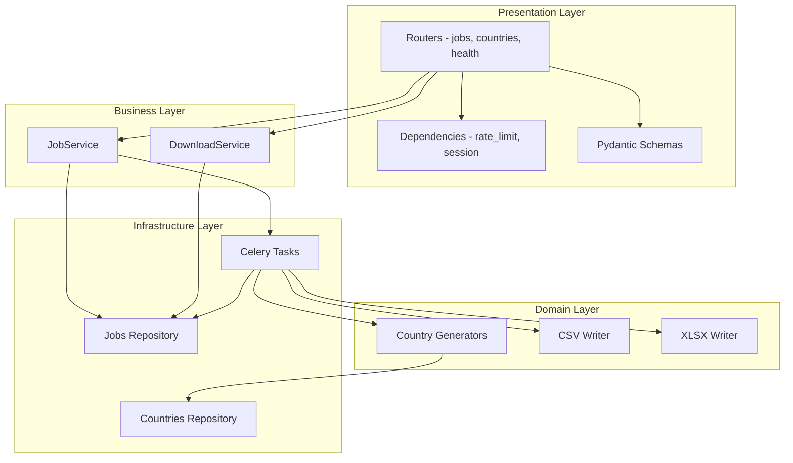
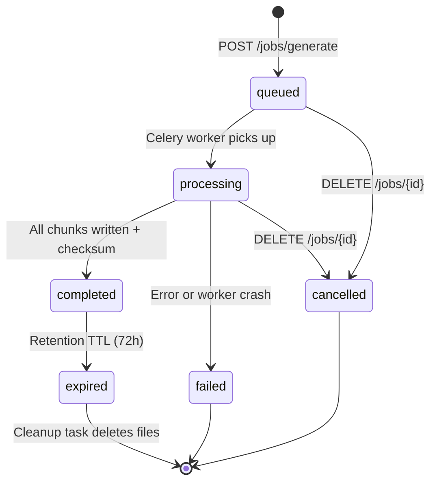
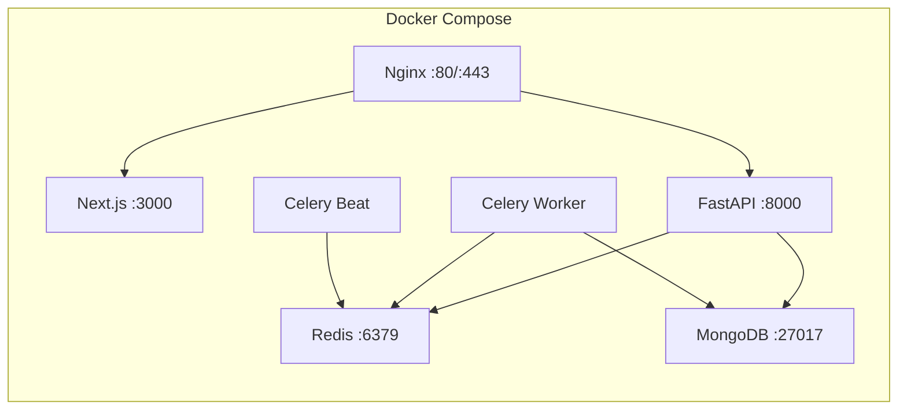
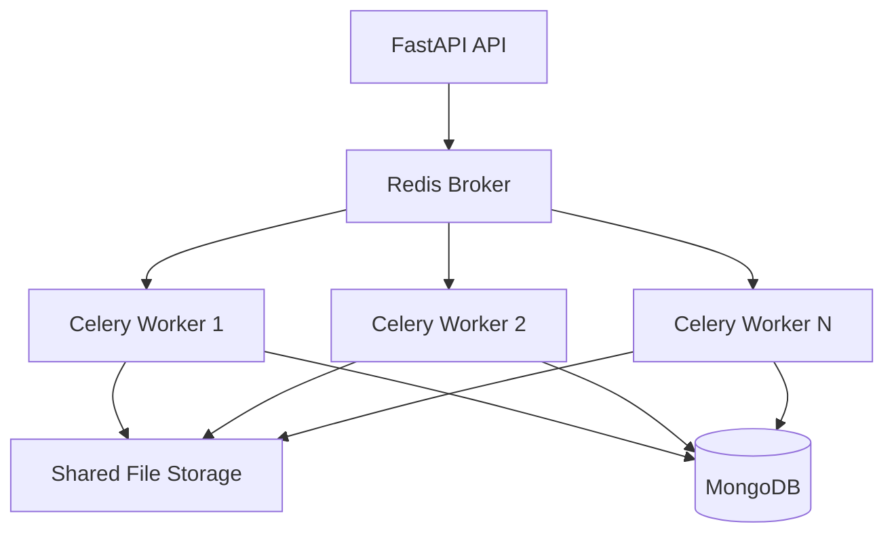

# System Architecture — Phone Number Generator

**Project:** Universal Phone Number Generator  
**Version:** 1.0  
**Last Updated:** June 2026

> Complete architecture reference covering system design, frontend, backend, infrastructure, deployment, and development roadmap.

---

## Table of Contents

1. [High-Level Architecture](#1-high-level-architecture)
2. [Technology Stack](#2-technology-stack)
3. [Frontend Architecture](#3-frontend-architecture)
4. [Backend Architecture](#4-backend-architecture)
5. [Data Flow](#5-data-flow)
6. [Infrastructure & Deployment](#6-infrastructure--deployment)
7. [Large-Scale Processing Strategy](#7-large-scale-processing-strategy)
8. [Development Roadmap](#8-development-roadmap)
9. [Technical Recommendations](#9-technical-recommendations)

---

## 1. High-Level Architecture



### Component Communication

| From | To | Protocol | Purpose |
|---|---|---|---|
| Browser | Next.js | HTTP/HTTPS | Pages, static assets |
| Browser | FastAPI | REST (JSON) | Job CRUD, downloads |
| Browser | FastAPI | SSE | Real-time progress |
| FastAPI | MongoDB | Motor (async) | Job metadata, country config |
| FastAPI | Redis | TCP | Enqueue tasks, rate limits |
| Celery | MongoDB | PyMongo (sync) | Progress updates |
| Celery | Disk | File I/O | Stream-write CSV/XLSX |
| FastAPI | Disk | File I/O | Serve downloads |
| Nginx | FastAPI/Next.js | HTTP proxy | SSL termination, load balancing |

---

## 2. Technology Stack

### Frontend

| Layer | Technology | Purpose |
|---|---|---|
| Framework | Next.js 14+ (App Router) | SSR/CSR pages, routing |
| Language | TypeScript | Type safety |
| Styling | Tailwind CSS | Utility-first CSS |
| Server State | React Query | API caching, polling |
| Client State | Zustand | Form state management |
| HTTP | Fetch API | Typed API client |

### Backend

| Layer | Technology | Purpose |
|---|---|---|
| Framework | FastAPI | REST API, validation, docs |
| Language | Python 3.11+ | Core logic |
| Task Queue | Celery | Background job processing |
| Message Broker | Redis | Celery broker + rate limiting |
| Database | MongoDB Atlas | Job metadata, country config |
| CSV Writing | Python csv module | Streaming CSV export |
| XLSX Writing | OpenPyXL | Streaming XLSX export |
| Validation | Pydantic v2 | Request/response schemas |

### Infrastructure

| Layer | Technology | Purpose |
|---|---|---|
| Containerization | Docker + Docker Compose | Service orchestration |
| Reverse Proxy | Nginx | SSL, routing, rate limiting |
| OS | Ubuntu VPS | Production host |
| Monitoring | Uptime Kuma / Prometheus | Health checks, alerts |
| SSL | Let's Encrypt (Certbot) | HTTPS certificates |

---

## 3. Frontend Architecture

### 3.1 Application Structure

```
frontend/
├── app/                         # Next.js App Router
│   ├── layout.tsx               # Root layout, providers, fonts
│   ├── page.tsx                 # Dashboard (/)
│   ├── generate/page.tsx        # Generation form
│   ├── history/page.tsx         # Job history
│   ├── jobs/[id]/page.tsx       # Job detail + progress
│   └── downloads/page.tsx       # Download center
├── components/
│   ├── layout/                  # Header, Footer, AppLayout
│   ├── generate/                # CountrySelector, GenerateForm, ExportOptions
│   ├── jobs/                    # ProgressBar, JobTable, DownloadButtons
│   └── ui/                      # Shared UI primitives (Button, Input, etc.)
├── lib/
│   ├── api-client.ts            # Typed fetch wrapper with session header
│   └── session.ts               # UUID session_id in localStorage
├── stores/
│   └── generate-store.ts        # Zustand: country, quantity, mode, export opts
├── hooks/
│   ├── useJobStatus.ts          # Poll job status every 2s
│   └── useHistory.ts            # Fetch paginated history
└── types/
    └── api.ts                   # JobStatus, Country, ExportOptions types
```

### 3.2 Page Flow



### 3.3 State Architecture



### 3.4 Key Frontend Decisions

- **No authentication UI** — session_id auto-generated on first visit
- **Polling over WebSocket** — React Query refetchInterval for simplicity
- **Optimistic UI** — show "queued" immediately after submit
- **Responsive design** — mobile-first with Tailwind breakpoints
- **XLSX guard** — disable XLSX radio when quantity > 1,048,576

---

## 4. Backend Architecture

### 4.1 Layered Design



### 4.2 Backend Module Map

| Module | File | Responsibility |
|---|---|---|
| Entry | `main.py` | FastAPI app, CORS, lifespan hooks |
| Config | `config.py` | Environment settings via pydantic-settings |
| Jobs Router | `routers/jobs.py` | Generate, status, download, cancel, history |
| Countries Router | `routers/countries.py` | List enabled countries |
| Health Router | `routers/health.py` | MongoDB + Redis + disk checks |
| Job Service | `services/job_service.py` | Create job, enqueue task, cancel |
| Download Service | `services/download_service.py` | HMAC tokens, file streaming |
| Generator Base | `domain/generators/base.py` | CountryGenerator protocol |
| Generator Registry | `domain/generators/registry.py` | Factory for 30 countries |
| CSV Writer | `domain/formats/csv_writer.py` | Streaming CSV with headers |
| XLSX Writer | `domain/formats/xlsx_writer.py` | OpenPyXL write-only export |
| Generate Task | `tasks/generate_task.py` | Celery: chunk loop + progress |
| Cleanup Task | `tasks/cleanup_task.py` | Celery Beat: delete expired files |
| Rate Limit | `dependencies/rate_limit.py` | Redis sliding window |

### 4.3 Job Lifecycle



---

## 5. Data Flow

### 5.1 Job Creation Flow

```
User fills form → Frontend POST /jobs/generate
  → FastAPI validates input (Pydantic)
  → Rate limit check (Redis)
  → Create job document in MongoDB (status: queued)
  → Enqueue Celery task via Redis
  → Return 202 { job_id, poll_url }
  → Frontend redirects to /jobs/{id}
  → React Query polls GET /jobs/{id}/status every 2s
```

### 5.2 Generation Flow

```
Celery worker receives task
  → Load job + country config from MongoDB
  → Create CountryGenerator for selected country
  → Open temp file on disk
  → Loop: generate 50k batch → write to file → update progress
  → Compute SHA-256 checksum
  → Atomic rename temp → final file
  → Update MongoDB: status=completed, file metadata
  → Frontend polling detects download_ready=true
```

### 5.3 Download Flow

```
User clicks Download
  → Frontend GET /jobs/{id}/download?format=csv
  → Backend validates session_id + download token
  → Stream file from disk via StreamingResponse
  → Browser saves file
```

---

## 6. Infrastructure & Deployment

### 6.1 Docker Compose Services



### 6.2 Service Configuration

| Service | Image/Build | Ports | Volumes |
|---|---|---|---|
| nginx | nginx:alpine | 80, 443 | `./docker/nginx/nginx.conf` |
| web | Dockerfile.web | 3000 (internal) | — |
| api | Dockerfile.api | 8000 (internal) | `./data/exports:/data/exports` |
| worker | Dockerfile.worker | — | `./data/exports:/data/exports` |
| beat | Dockerfile.worker | — | — |
| redis | redis:7-alpine | 6379 (internal) | redis-data |
| mongo | mongo:7 | 27017 (internal) | mongo-data |

### 6.3 Nginx Routing

| Path | Upstream | Notes |
|---|---|---|
| `/` | Next.js :3000 | Frontend pages |
| `/api/v1/*` | FastAPI :8000 | REST API |
| `/api/v1/jobs/*/download` | FastAPI :8000 | Large file downloads, extended timeout |

### 6.4 Production VPS Requirements

| Resource | Minimum | Recommended |
|---|---|---|
| vCPU | 4 | 8 |
| RAM | 8 GB | 16 GB |
| SSD | 100 GB | 200 GB |
| OS | Ubuntu 22.04+ | Ubuntu 24.04 |

### 6.5 Environment Variables

See [`.env.example`](../.env.example) for full list. Key variables:

```
MONGODB_URI, REDIS_URL, CELERY_BROKER_URL
EXPORTS_DIR=/data/exports
SECRET_KEY, CORS_ORIGINS
MIN_QUANTITY=5000000, MAX_QUANTITY=20000000
FILE_RETENTION_HOURS=72
```

---

## 7. Large-Scale Processing Strategy

### 7.1 Memory Management

```
Total numbers: 20,000,000
Chunk size:    50,000
Total chunks:  400

Per chunk in RAM: ~5 MB (50k strings)
Peak RAM:         ~5 MB generation + ~10 MB OpenPyXL buffer
Target:           < 256 MB per worker
```

**Rules:**
- Never accumulate all numbers in a list
- Generator yields one batch at a time
- File writer flushes every chunk
- `gc.collect()` optional after each chunk

### 7.2 Processing Pipeline

```
┌─────────────┐    ┌──────────────┐    ┌─────────────┐    ┌──────────────┐
│  Generator   │───>│ Batch 50k    │───>│ File Writer │───>│ Progress     │
│  (per country)│    │ in memory    │    │ (stream)    │    │ Update (DB)  │
└─────────────┘    └──────────────┘    └─────────────┘    └──────────────┘
       ↑                  │                                       │
       └──────────────────┘              every 5 chunks ──────────┘
              next batch
```

### 7.3 Scale Comparison

| Metric | 5M | 10M | 20M |
|---|---|---|---|
| Chunks (50k) | 100 | 200 | 400 |
| CSV file size | ~60–80 MB | ~120–160 MB | ~240–320 MB |
| Est. time (1 worker) | 8–12 min | 16–24 min | 32–48 min |
| MongoDB progress updates | ~20 | ~40 | ~80 |
| RAM per worker | ~50 MB | ~50 MB | ~50 MB |

### 7.4 Horizontal Scaling



Add worker containers without schema changes. Shared volume or NFS for `/data/exports`.

---

## 8. Development Roadmap

| Sprint | Duration | Deliverables |
|---|---|---|
| **Sprint 1 — Project Setup** | 1 week | Monorepo scaffold, Docker Compose, Nginx, env templates |
| **Sprint 2 — Database** | 1 week | MongoDB schemas, 30 country seed, indexes, repositories |
| **Sprint 3 — Backend APIs** | 1.5 weeks | FastAPI routers, Pydantic schemas, rate limiting, session middleware |
| **Sprint 4 — Number Generation** | 2 weeks | CountryGenerator strategy, 30 country rules, sequential + random, tests |
| **Sprint 5 — File Export** | 1.5 weeks | CSV/XLSX streaming, Celery integration, progress, checksum, cleanup |
| **Sprint 6 — Frontend UI** | 2 weeks | All screens, Zustand, React Query polling, Tailwind design |
| **Sprint 7 — Testing** | 1.5 weeks | Load tests 5M/10M/20M, memory profiling, E2E Playwright |
| **Sprint 8 — Deployment** | 1 week | Production VPS, SSL, MongoDB Atlas, monitoring, backups |

**Total: 11–12 weeks** (1 developer) | **8–9 weeks** (2 developers)

---

## 9. Technical Recommendations

### Architecture

- Job-centric async architecture — never generate synchronously in API process
- SSE over WebSocket for one-way progress updates
- Nginx `X-Accel-Redirect` for large file downloads

### Performance

- Batch size 50,000 balances memory and I/O flush frequency
- Use `orjson` for API JSON serialization
- Separate Celery worker container from API container
- MongoDB progress updates every 5 chunks (not every chunk)

### MongoDB

- Motor (async) in FastAPI; PyMongo (sync) in Celery workers
- Compound indexes match query patterns
- Never embed number arrays in documents
- TTL or scheduled cleanup for expired jobs

### Redis

- DB 0: Celery broker | DB 1: Rate limits | DB 2: Progress pub/sub
- `maxmemory-policy allkeys-lru`

### FastAPI

- Structured JSON logging with `job_id` correlation
- Health checks: MongoDB ping, Redis ping, disk space
- OpenAPI docs enabled in staging only

### Monitoring

- Metrics: job duration, numbers/sec, queue depth, failed jobs, disk usage
- Alerts: disk > 80%, worker down, job failure rate > 5%
- Tools: Uptime Kuma (simple) or Prometheus + Grafana (advanced)

---

## Related Documents

| Document | Path | Contents |
|---|---|---|
| Software Requirements | [docs/SRS.md](./SRS.md) | Functional/non-functional requirements, edge cases |
| Technical Design | [docs/TDD.md](./TDD.md) | Backend, frontend, API, database, security details |
| Environment Config | [.env.example](../.env.example) | All environment variables |
