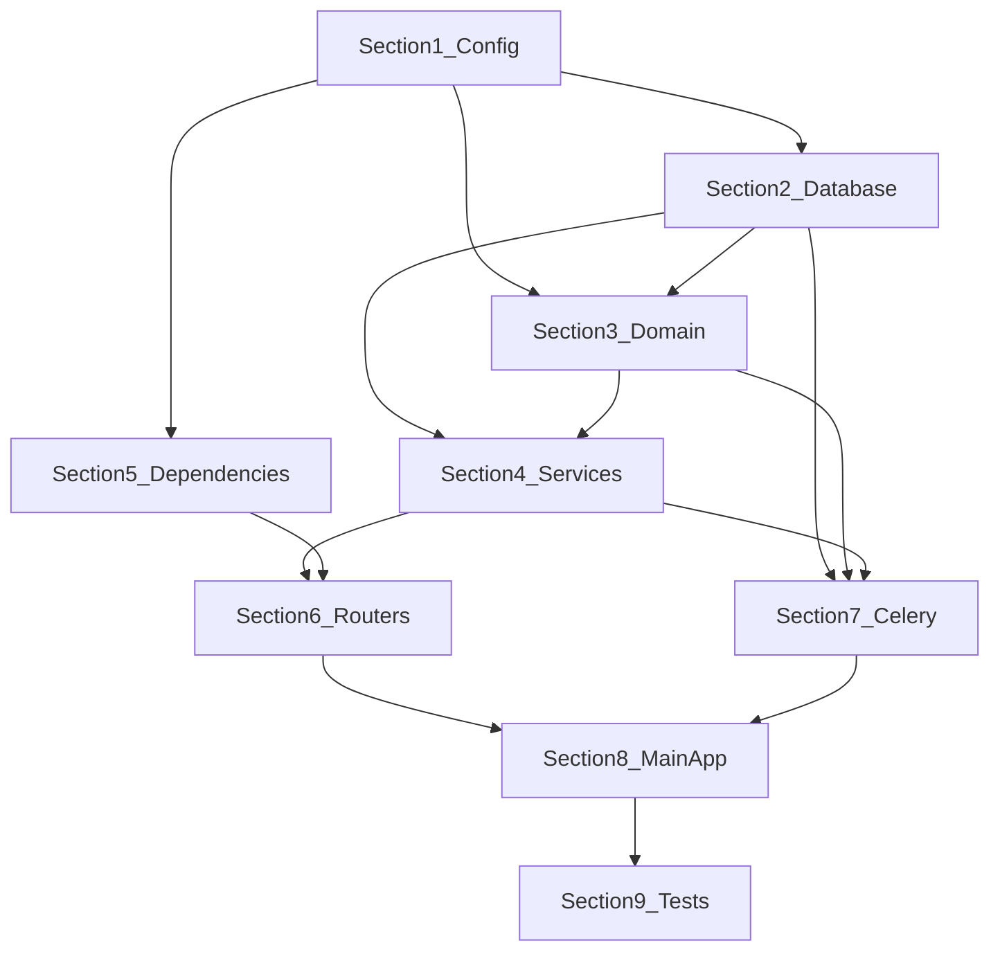

# Backend Implementation Guide

**Project:** Universal Phone Number Generator  
**Goal:** Backend code likhne se pehle har section ka context samjho, phir order mein code likho.

> **Rule:** Har section complete karo, phir next section par jao. Har section batata hai ki pichle section se kya dependency hai.

---

## Section Order (Code likhne ka sequence)

```
Section 1 → Section 2 → Section 3 → Section 4 → Section 5 → Section 6 → Section 7 → Section 8 → Section 9
  Config      Database     Domain      Services    Deps        API        Celery      Main       Tests
```

---

## Section 1 — Foundation & Configuration

### Context (Kyun aur kya)

Ye **sabse pehla step** hai. Iske bina koi bhi file env variables ya settings use nahi kar sakti.

- FastAPI app ko MongoDB, Redis, file paths chahiye
- Celery worker ko same settings chahiye
- Quantity limits (5M–20M), chunk size (50k), retention (72h) yahi se aayenge

### Depends On
- Kuch nahi — ye root section hai

### Files to Write

| File | Purpose |
|---|---|
| `backend/app/__init__.py` | Package marker |
| `backend/app/config.py` | `pydantic-settings` se env read |
| `shared/country-metadata/countries.json` | 30 countries ka static data (generator + seed dono use karenge) |

### `config.py` mein ye settings honi chahiye

```python
# Key settings
app_env, secret_key, api_prefix
mongodb_uri, mongodb_db
redis_url, redis_rate_limit_db, redis_progress_db
celery_broker_url, celery_result_backend
exports_dir, file_retention_hours, chunk_size
min_quantity, max_quantity, xlsx_max_rows
rate_limit_jobs_per_hour_ip, rate_limit_jobs_per_day_session
download_token_ttl_seconds, cors_origins
```

### Next Section Connection
→ Section 2 is `config.py` aur `countries.json` use karega database connect aur seed ke liye

---

## Section 2 — Schemas & Database Layer

### Context (Kyun aur kya)

API request/response aur MongoDB documents ke beech **contract** define karta hai.

- Frontend se aane wala JSON validate hoga
- MongoDB mein job document ka structure fixed rahega
- Repository layer sirf typed data use karegi

### Depends On
- **Section 1:** `config.py` (MongoDB URI, DB name)

### Files to Write

| File | Purpose |
|---|---|
| `backend/app/schemas/__init__.py` | |
| `backend/app/schemas/country.py` | Country response models |
| `backend/app/schemas/job.py` | Job create, status, history, progress models |
| `backend/app/database.py` | Motor async client + sync pymongo for Celery |
| `backend/app/repositories/__init__.py` | |
| `backend/app/repositories/countries_repo.py` | CRUD for countries collection |
| `backend/app/repositories/jobs_repo.py` | CRUD for jobs collection |
| `backend/scripts/seed_countries.py` | `countries.json` → MongoDB seed |

### Important Schemas

**Job Create Request:**
- `country_code`, `quantity`, `generation_mode`, `export_format`, `export_options`

**Job Status Response:**
- `job_id`, `status`, `progress`, `download_ready`

**Job Document (MongoDB):**
- `_id`, `session_id`, `status`, `progress`, `files`, `expires_at`, etc.

### MongoDB Indexes (seed script mein create karo)

```javascript
countries: { enabled: 1, display_order: 1 }
jobs: { session_id: 1, created_at: -1 }
jobs: { status: 1, created_at: 1 }
jobs: { client_request_id: 1 }  // unique sparse
jobs: { expires_at: 1 }
```

### Next Section Connection
→ Section 3 generators ko country rules chahiye — `countries.json` / MongoDB se load honge

---

## Section 3 — Domain Layer (Generators + File Writers)

### Context (Kyun aur kya)

Ye **core business logic** hai — phone numbers generate karna aur file mein likhna.

- API ya Celery directly numbers generate nahi karega
- Sab `CountryGenerator` aur `FileWriter` use karega
- 5M–20M numbers memory mein nahi, **chunk-by-chunk** generate honge

### Depends On
- **Section 1:** `config.py` (chunk_size, min/max quantity)
- **Section 2:** Country rules structure (`mobile_rules` from countries)

### Files to Write

| File | Purpose |
|---|---|
| `backend/app/domain/__init__.py` | |
| `backend/app/domain/generators/__init__.py` | |
| `backend/app/domain/generators/base.py` | `CountryGenerator` protocol/base class |
| `backend/app/domain/generators/registry.py` | Factory: country_code → generator instance |
| `backend/app/domain/formats/__init__.py` | |
| `backend/app/domain/formats/csv_writer.py` | Streaming CSV writer |
| `backend/app/domain/formats/xlsx_writer.py` | OpenPyXL write-only writer |

### Generator Interface

```python
class CountryGenerator:
    def validate(self, quantity: int, mode: str) -> str | None: ...
    def generate_batch(self, batch_size: int, offset: int, mode: str) -> list[str]: ...
    def format_number(self, number: str, include_country_code: bool) -> str: ...
```

### Generation Modes

| Mode | Logic |
|---|---|
| `sequential` | `sequential_start + offset + i`, prefix validate |
| `random` | `random.choice(prefixes) + random remaining digits` |

### File Writers

**CSV Writer:**
- Header row: optional `S.No` + column name
- Stream rows, flush every batch
- Temp file → atomic rename on complete

**XLSX Writer:**
- OpenPyXL `write_only=True`
- Max 1,048,576 rows — isse zyada par error

### 30 Countries

`registry.py` `countries.json` se rules load karke generic generator banayega — har country ke liye alag file ki zaroorat nahi.

### Next Section Connection
→ Section 4 services job create karte waqt generator validate karega; Celery task (Section 7) generator + writer use karega

---

## Section 4 — Services Layer

### Context (Kyun aur kya)

Routers **thin** rahenge — saari business logic services mein.

- Job create, cancel, status — `JobService`
- Download token, file stream — `DownloadService`

### Depends On
- **Section 2:** `jobs_repo`, `countries_repo`, schemas
- **Section 3:** `registry.py` (validation before job create)

### Files to Write

| File | Purpose |
|---|---|
| `backend/app/services/__init__.py` | |
| `backend/app/services/job_service.py` | Create, cancel, get status, history |
| `backend/app/services/download_service.py` | HMAC token, file path resolve, stream |

### JobService Methods

| Method | Kya karta hai |
|---|---|
| `create_job()` | Validate country + quantity + format → insert MongoDB → enqueue Celery |
| `get_job_status()` | Job fetch by id + session_id |
| `cancel_job()` | Atomic status update queued/processing → cancelled |
| `get_history()` | Session ke jobs, paginated |
| `estimate_duration()` | Quantity se approximate seconds |

### DownloadService Methods

| Method | Kya karta hai |
|---|---|
| `create_download_token()` | HMAC sign: job_id + session_id + expiry |
| `verify_download_token()` | Token validate |
| `get_file_path()` | Job files se safe path (no traversal) |
| `stream_file()` | Generator for StreamingResponse |

### Next Section Connection
→ Section 5 dependencies (session, rate limit) routers se pehle inject honge; Section 6 routers in services ko call karenge

---

## Section 5 — Dependencies (Session + Rate Limit)

### Context (Kyun aur kya)

Har API request par **session check** aur **rate limit** lagana hai.

- Login nahi hai — `X-Session-Id` header se user identify
- Redis sliding window se abuse rokna

### Depends On
- **Section 1:** `config.py` (Redis URL, rate limit values)

### Files to Write

| File | Purpose |
|---|---|
| `backend/app/dependencies/__init__.py` | |
| `backend/app/dependencies/session.py` | `X-Session-Id` extract + validate UUID |
| `backend/app/dependencies/rate_limit.py` | Redis sliding window per IP + session |

### Rate Limits

| Limit | Default |
|---|---|
| Jobs per hour per IP | 3 |
| Jobs per day per session | 10 |

### Response on limit exceeded
- HTTP 429
- Header: `Retry-After: <seconds>`

### Next Section Connection
→ Section 6 routers in dependencies ko `Depends()` se use karenge

---

## Section 6 — API Routers

### Context (Kyun aur kya)

Frontend se direct baat ye layer karegi — **HTTP endpoints**.

### Depends On
- **Section 4:** JobService, DownloadService
- **Section 5:** session, rate_limit dependencies
- **Section 2:** Pydantic schemas for request/response

### Files to Write

| File | Purpose |
|---|---|
| `backend/app/routers/__init__.py` | |
| `backend/app/routers/health.py` | `GET /health` — MongoDB + Redis + disk |
| `backend/app/routers/countries.py` | `GET /countries` |
| `backend/app/routers/jobs.py` | Generate, status, download, cancel, history, SSE |

### API Endpoints

| Method | Path | Service |
|---|---|---|
| GET | `/health` | Direct checks |
| GET | `/countries` | countries_repo |
| POST | `/jobs/generate` | job_service.create_job |
| GET | `/jobs/{id}/status` | job_service.get_job_status |
| GET | `/jobs/{id}/download` | download_service.stream_file |
| POST | `/jobs/{id}/download-token` | download_service.create_token |
| DELETE | `/jobs/{id}` | job_service.cancel_job |
| GET | `/history` | job_service.get_history |
| GET | `/jobs/{id}/events` | SSE progress (optional) |

### Headers (sab job endpoints par)

```
X-Session-Id: <uuid>
X-Client-Request-Id: <uuid>  (optional, idempotency)
```

### Next Section Connection
→ Section 7 Celery tasks background mein generation karenge jo Section 6 ke `POST /jobs/generate` se trigger hote hain

---

## Section 7 — Celery Tasks (Background Workers)

### Context (Kyun aur kya)

5M–20M numbers **API thread mein nahi** — background worker mein generate honge.

- Job create hone par Redis queue mein task jata hai
- Worker chunk-by-chunk generate karke file likhta hai
- Progress MongoDB mein update hota hai

### Depends On
- **Section 1:** Celery broker URL, exports_dir, chunk_size
- **Section 2:** jobs_repo (sync pymongo)
- **Section 3:** generators + file writers
- **Section 4:** Job status constants

### Files to Write

| File | Purpose |
|---|---|
| `backend/app/tasks/__init__.py` | |
| `backend/app/tasks/celery_app.py` | Celery instance, config, beat schedule |
| `backend/app/tasks/generate_task.py` | Main generation loop |
| `backend/app/tasks/cleanup_task.py` | Expired files delete (hourly) |

### Generate Task Flow

```
1. Load job from MongoDB
2. If status != queued → return (idempotent)
3. Update status → processing
4. Create generator from registry
5. Open CSV/XLSX writer (temp file)
6. For each chunk (50k):
     - Check if cancelled
     - batch = generator.generate_batch()
     - writer.write_rows(batch)
     - Every 5 chunks: update progress in MongoDB
7. Finalize file (rename + SHA-256)
8. Update status → completed
9. On error → status failed, delete temp file
```

### Celery Beat Schedule

```python
"cleanup-expired-files": {
    "task": "tasks.cleanup_expired_files",
    "schedule": crontab(minute=0),  # every hour
}
```

### Next Section Connection
→ Section 8 sab routers, tasks, database ko `main.py` mein wire karega

---

## Section 8 — Main App & Integration

### Context (Kyun aur kya)

Sab pieces ko **ek FastAPI app** mein jodna — entry point.

### Depends On
- **Section 1–7:** Sab modules

### Files to Write

| File | Purpose |
|---|---|
| `backend/app/main.py` | FastAPI app, CORS, lifespan, router include |
| `docker/Dockerfile.api` | API container |
| `docker/Dockerfile.worker` | Celery worker container |
| `docker/docker-compose.yml` | api, worker, beat, redis, mongo |

### `main.py` Checklist

- [ ] Lifespan: MongoDB connect on startup, disconnect on shutdown
- [ ] CORS middleware with `cors_origins` from config
- [ ] Include routers with prefix `/api/v1`
- [ ] Default response class ORJSON if using orjson
- [ ] Exception handlers for 422, 429, 404

### Docker Services

| Service | Command |
|---|---|
| api | `uvicorn app.main:app --host 0.0.0.0 --port 8000` |
| worker | `celery -A app.tasks.celery_app worker -Q generation --concurrency=2` |
| beat | `celery -A app.tasks.celery_app beat` |

### Next Section Connection
→ Section 9 tests se verify karo ki sab sections sahi kaam kar rahe hain

---

## Section 9 — Backend Tests

### Context (Kyun aur kya)

Har section ke baad tests likhne se bugs jaldi pakde jate hain.

### Depends On
- **Section 1–8:** Complete backend

### Files to Write

| File | Purpose |
|---|---|
| `backend/tests/conftest.py` | Test fixtures, mock MongoDB/Redis |
| `backend/tests/test_generators.py` | Per-country format validation |
| `backend/tests/test_csv_writer.py` | Streaming CSV output |
| `backend/tests/test_job_service.py` | Create, cancel, validation |
| `backend/tests/test_api_jobs.py` | HTTP endpoint integration |
| `backend/tests/test_rate_limit.py` | 429 responses |

### Test Priorities

1. Generator: India 10-digit, UAE, USA formats
2. Quantity validation: 4M reject, 21M reject
3. XLSX > 1M rows reject
4. Job lifecycle: queued → processing → completed
5. Cancel during processing

---

## Quick Reference — File Tree (Backend Complete)

```
backend/
├── app/
│   ├── __init__.py
│   ├── main.py                 ← Section 8
│   ├── config.py               ← Section 1
│   ├── database.py             ← Section 2
│   ├── schemas/
│   │   ├── country.py          ← Section 2
│   │   └── job.py              ← Section 2
│   ├── repositories/
│   │   ├── countries_repo.py   ← Section 2
│   │   └── jobs_repo.py        ← Section 2
│   ├── domain/
│   │   ├── generators/
│   │   │   ├── base.py         ← Section 3
│   │   │   └── registry.py     ← Section 3
│   │   └── formats/
│   │       ├── csv_writer.py   ← Section 3
│   │       └── xlsx_writer.py  ← Section 3
│   ├── services/
│   │   ├── job_service.py      ← Section 4
│   │   └── download_service.py ← Section 4
│   ├── dependencies/
│   │   ├── session.py          ← Section 5
│   │   └── rate_limit.py       ← Section 5
│   ├── routers/
│   │   ├── health.py           ← Section 6
│   │   ├── countries.py        ← Section 6
│   │   └── jobs.py             ← Section 6
│   └── tasks/
│       ├── celery_app.py       ← Section 7
│       ├── generate_task.py    ← Section 7
│       └── cleanup_task.py     ← Section 7
├── scripts/
│   └── seed_countries.py       ← Section 2
└── tests/                      ← Section 9
```

---

## Section Dependency Diagram



---

## Code likhte waqt yaad rakho

1. **Pehle context padho** — section ke "Depends On" ko samjho
2. **Ek section complete karo** — phir next par jao
3. **Numbers MongoDB mein mat daalo** — sirf file mein likho
4. **Chunk size 50,000** — memory safe rehne ke liye
5. **Temp file → atomic rename** — corrupt file se bachne ke liye
6. **Session header har job API par** — ownership ke liye
