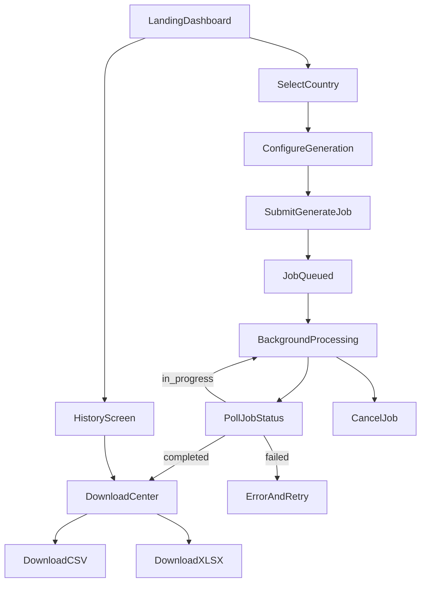

# Software Requirements Specification (SRS)

**Project:** Universal Phone Number Generator  
**Version:** 1.0  
**Last Updated:** June 2026

---

## 1. Product Overview

A large-scale web application that generates format-valid mobile phone numbers for **30 countries**, exports them as **CSV or XLSX**, and handles **5,000,000 to 20,000,000** numbers per job without loading the full dataset into memory.

Jobs run asynchronously via background workers. Users track progress in real time and download completed files through secure, time-limited links.

### Key Stakeholder Decisions

| Decision | Choice |
|---|---|
| Authentication | Open access with rate limiting only (no login/registration) |
| Export format | User-selectable (column name, country code prefix, S.No column) |
| Scale range | 50 Lakh (5M) to 2 Crore (20M) numbers per job |

---

## 2. User Flow

### Anonymous Session Model

1. On first visit, frontend generates a `session_id` (UUID) stored in `localStorage`.
2. All jobs are associated with `session_id` for history and download authorization.
3. Rate limits apply per IP + per session.

---

## 3. Functional Requirements

| ID | Requirement |
|---|---|
| FR-01 | Display 30 supported countries with dial code and flag/name |
| FR-02 | Accept quantity input: min 5,000,000, max 20,000,000 |
| FR-03 | Generate numbers conforming to selected country's mobile format rules |
| FR-04 | Support **sequential** and **random** generation modes |
| FR-05 | User selects export options: column header name, include `+country_code`, include `S.No` column |
| FR-06 | Export as CSV (streaming) or XLSX (streaming write-only) |
| FR-07 | Async job creation with immediate `job_id` return |
| FR-08 | Real-time job status: queued, processing, completed, failed, cancelled |
| FR-09 | Progress reporting: percent complete, numbers generated, ETA estimate |
| FR-10 | Download completed files via authenticated job token |
| FR-11 | Job history scoped to anonymous session (last 30 days) |
| FR-12 | Cancel in-progress jobs |
| FR-13 | Auto-cleanup of files after configurable retention (default 72 hours) |

---

## 4. Non-Functional Requirements

| ID | Requirement | Target |
|---|---|---|
| NFR-01 | Max job size | 20,000,000 numbers |
| NFR-02 | API response time (job create) | < 500ms |
| NFR-03 | Worker memory per job | < 256 MB steady-state |
| NFR-04 | Concurrent large jobs | 2–4 per worker node (configurable) |
| NFR-05 | CSV generation throughput | ≥ 500k numbers/minute per worker |
| NFR-06 | File integrity | Checksum (SHA-256) stored with job |
| NFR-07 | Availability | 99.5% uptime on single VPS (Phase 1) |
| NFR-08 | Horizontal scaling path | Worker nodes can be added without schema changes |

---

## 5. Supported Countries (30)

| # | Country | Dial Code | ISO |
|---|---|---|---|
| 1 | India | +91 | IN |
| 2 | UAE | +971 | AE |
| 3 | USA | +1 | US |
| 4 | UK | +44 | GB |
| 5 | Canada | +1 | CA |
| 6 | Australia | +61 | AU |
| 7 | Germany | +49 | DE |
| 8 | France | +33 | FR |
| 9 | Italy | +39 | IT |
| 10 | Spain | +34 | ES |
| 11 | Netherlands | +31 | NL |
| 12 | Singapore | +65 | SG |
| 13 | Malaysia | +60 | MY |
| 14 | Saudi Arabia | +966 | SA |
| 15 | Qatar | +974 | QA |
| 16 | Kuwait | +965 | KW |
| 17 | Oman | +968 | OM |
| 18 | Bahrain | +973 | BH |
| 19 | Pakistan | +92 | PK |
| 20 | Bangladesh | +880 | BD |
| 21 | Nepal | +977 | NP |
| 22 | Sri Lanka | +94 | LK |
| 23 | South Africa | +27 | ZA |
| 24 | Brazil | +55 | BR |
| 25 | Mexico | +52 | MX |
| 26 | Turkey | +90 | TR |
| 27 | Indonesia | +62 | ID |
| 28 | Thailand | +66 | TH |
| 29 | Philippines | +63 | PH |
| 30 | Japan | +81 | JP |

---

## 6. System Limitations

- Numbers are **syntactically valid**, not verified against carrier assignments.
- Random mode at 20M scale may produce duplicate numbers within a batch.
- Sequential mode guarantees uniqueness within valid range bounds.
- XLSX capped at 1,048,576 rows (Excel limit); CSV recommended for large jobs.
- Single VPS disk is a bottleneck; plan for ≥ 100 GB free storage.
- No user accounts — history is session-bound and lost if `localStorage` is cleared.

---

## 7. Edge Cases

| Edge Case | Handling |
|---|---|
| Quantity below 5M or above 20M | 422 validation error |
| Invalid country code | Reject at API validation |
| Worker crash mid-job | Job marked `failed`, partial file deleted |
| Duplicate job submission | Idempotency key deduplicates within 60s |
| Disk full during write | Fail job, cleanup partial files |
| XLSX request > 1M rows | 422 — use CSV for large jobs |
| Rate limit exceeded | 429 with `Retry-After` header |
| Download of expired file | 410 Gone |
| Cancel + complete race | MongoDB atomic status transition |
| India/USA shared +1 code | Country selection uses ISO code, not dial code |

---

## 8. Security Requirements

- IP-based + session-based rate limiting (Redis sliding window)
- Signed download tokens (HMAC, 15-min TTL)
- Input validation on all API fields (Pydantic strict models)
- File path traversal prevention — downloads only via `job_id`
- CORS restricted to frontend origin
- Nginx request size limits for large downloads
- No PII stored beyond IP (hashed) and session UUID
