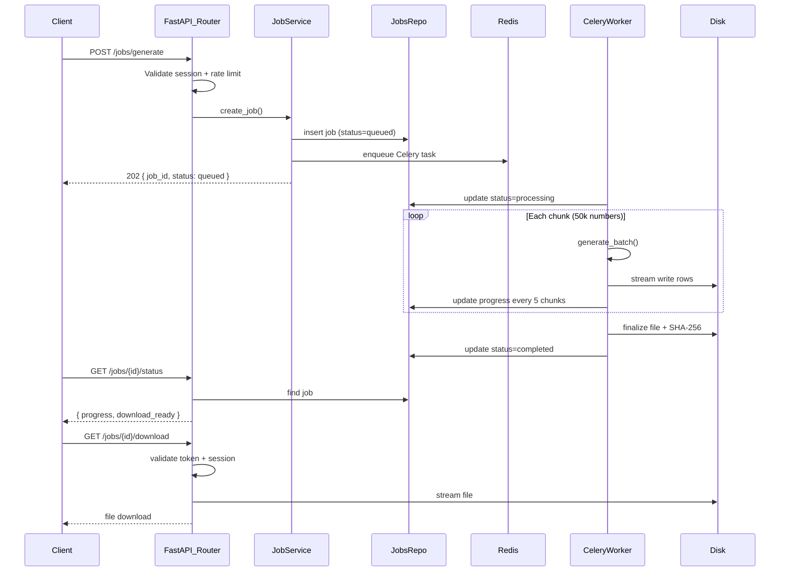
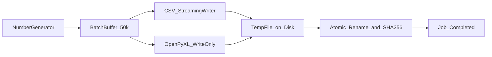

# Technical Design Document (TDD)

**Project:** Universal Phone Number Generator  
**Version:** 1.0  
**Last Updated:** June 2026

---

## Table of Contents

1. [Backend Design](#1-backend-design)
2. [Frontend Design](#2-frontend-design)
3. [Database Design](#3-database-design)
4. [API Design](#4-api-design)
5. [Queue & Worker Design](#5-queue--worker-design)
6. [File Generation Design](#6-file-generation-design)
7. [Security Design](#7-security-design)
8. [Folder Structure](#8-folder-structure)

---

## 1. Backend Design

### 1.1 Technology Stack

| Component | Technology |
|---|---|
| Framework | Python 3.11+ / FastAPI |
| Async DB Driver | Motor (MongoDB) |
| Sync DB Driver | PyMongo (Celery workers) |
| Task Queue | Celery + Redis |
| Validation | Pydantic v2 |
| CSV Export | Python `csv` module (streaming) |
| XLSX Export | OpenPyXL (write-only mode) |
| JSON Serialization | orjson |

### 1.2 Layered Architecture

```
backend/app/
├── main.py              # FastAPI app entry, CORS, lifespan
├── config.py            # Settings from environment
├── routers/             # HTTP endpoints
│   ├── jobs.py          # Generate, status, download, cancel
│   ├── countries.py     # List countries
│   └── health.py        # Liveness/readiness
├── services/            # Business logic
│   ├── job_service.py   # Job orchestration
│   └── download_service.py  # Token issuance, file streaming
├── domain/              # Core domain logic
│   ├── generators/      # Country number generators (strategy pattern)
│   │   ├── base.py      # CountryGenerator interface
│   │   └── registry.py  # Factory for 30 countries
│   └── formats/         # File writers
│       ├── csv_writer.py
│       └── xlsx_writer.py
├── repositories/        # Data access
│   ├── jobs_repo.py
│   └── countries_repo.py
├── tasks/               # Celery tasks
│   ├── celery_app.py
│   ├── generate_task.py
│   └── cleanup_task.py
├── dependencies/        # FastAPI deps
│   ├── rate_limit.py
│   └── session.py
└── schemas/             # Pydantic models
    ├── job.py
    └── country.py
```

### 1.3 Backend Request Flow



### 1.4 Number Generation Engine

Each country implements the `CountryGenerator` interface:

```python
class CountryGenerator(Protocol):
    def validate_config(self, quantity: int, mode: str) -> None | str: ...
    def generate_batch(self, batch_size: int, offset: int) -> list[str]: ...
```

**Generation modes:**

| Mode | Logic | Uniqueness |
|---|---|---|
| Sequential | `start + offset + i` with prefix validation | Guaranteed within range |
| Random | `random.choice(prefixes) + random_digits(remaining)` | Best-effort (large address space) |

**Chunk pipeline:**

```
for chunk_index in range(total_chunks):
    batch = generator.generate_batch(50000, offset)
    writer.write_rows(batch)
    if chunk_index % 5 == 0:
        update_mongodb_progress()
        publish_redis_progress()
    offset += 50000
```

### 1.5 Backend Configuration

| Variable | Default | Description |
|---|---|---|
| `MONGODB_URI` | `mongodb://mongo:27017` | MongoDB connection |
| `REDIS_URL` | `redis://redis:6379/0` | Celery broker |
| `EXPORTS_DIR` | `/data/exports` | File storage path |
| `CHUNK_SIZE` | `50000` | Numbers per batch |
| `MIN_QUANTITY` | `5000000` | Min job size |
| `MAX_QUANTITY` | `20000000` | Max job size |
| `FILE_RETENTION_HOURS` | `72` | Auto-cleanup TTL |
| `RATE_LIMIT_JOBS_PER_HOUR_IP` | `3` | IP rate limit |
| `RATE_LIMIT_JOBS_PER_DAY_SESSION` | `10` | Session rate limit |

---

## 2. Frontend Design

### 2.1 Technology Stack

| Component | Technology |
|---|---|
| Framework | Next.js 14+ (App Router) |
| Language | TypeScript |
| Styling | Tailwind CSS |
| Server State | React Query (TanStack Query) |
| Client State | Zustand |
| HTTP Client | Typed fetch wrapper |

### 2.2 Frontend Architecture

```
frontend/
├── app/                    # Next.js App Router pages
│   ├── layout.tsx          # Root layout + providers
│   ├── page.tsx            # Dashboard (/)
│   ├── generate/page.tsx   # Generate form (/generate)
│   ├── history/page.tsx    # Job history (/history)
│   ├── jobs/[id]/page.tsx  # Job detail + progress (/jobs/:id)
│   └── downloads/page.tsx  # Download center (/downloads)
├── components/
│   ├── layout/
│   │   ├── Header.tsx
│   │   ├── Footer.tsx
│   │   └── AppLayout.tsx
│   ├── generate/
│   │   ├── CountrySelector.tsx
│   │   ├── GenerateForm.tsx
│   │   ├── QuantityInput.tsx
│   │   ├── ModeToggle.tsx
│   │   └── ExportOptionsPanel.tsx
│   └── jobs/
│       ├── ProgressBar.tsx
│       ├── JobMetadata.tsx
│       ├── JobTable.tsx
│       └── DownloadButtons.tsx
├── lib/
│   ├── api-client.ts       # Typed API wrapper
│   └── session.ts          # session_id management
├── stores/
│   └── generate-store.ts   # Zustand form state
├── hooks/
│   └── useJobStatus.ts     # React Query polling hook
└── types/
    └── api.ts              # Shared TypeScript types
```

### 2.3 Screens & Routes

| Screen | Route | Purpose |
|---|---|---|
| Dashboard | `/` | Overview, quick generate CTA, recent jobs |
| Generate | `/generate` | Country selector + generation form |
| Job Detail | `/jobs/[id]` | Progress tracking, cancel, download |
| History | `/history` | Past jobs for current session |
| Download Center | `/downloads` | Completed files ready to download |

### 2.4 Component Hierarchy

```
AppLayout
├── Header (logo, navigation links)
├── SessionProvider (init session_id on mount)
└── Pages
    ├── DashboardPage
    │   ├── StatsCards
    │   └── RecentJobsList
    ├── GeneratePage
    │   ├── CountrySelector (searchable grid)
    │   ├── GenerateForm
    │   │   ├── QuantityInput (5M–20M validation)
    │   │   ├── ModeToggle (sequential / random)
    │   │   └── ExportOptionsPanel
    │   │       ├── ColumnNameInput
    │   │       ├── CountryCodeToggle
    │   │       ├── SerialColumnToggle
    │   │       └── FormatRadio (CSV / XLSX)
    │   └── SubmitButton
    ├── JobDetailPage
    │   ├── ProgressBar (animated, percent + ETA)
    │   ├── JobMetadata (country, quantity, format)
    │   ├── CancelButton
    │   └── DownloadButtons
    └── HistoryPage
        ├── JobTable (sortable, paginated)
        └── Pagination
```

### 2.5 State Management

| State Type | Tool | Scope |
|---|---|---|
| Form inputs (country, quantity, mode, export options) | Zustand | Client-only |
| Job list, job status, history | React Query | Server state with cache |
| Session ID | localStorage + React context | Persistent across visits |
| Active job polling | React Query `refetchInterval: 2000` | Auto-stop when terminal status |

### 2.6 API Client

```typescript
// lib/api-client.ts
const apiClient = {
  headers: {
    'X-Session-Id': getSessionId(),
    'Content-Type': 'application/json',
  },
  post: (path, body) => fetch(`${API_URL}${path}`, { method: 'POST', ... }),
  get: (path) => fetch(`${API_URL}${path}`, { ... }),
  delete: (path) => fetch(`${API_URL}${path}`, { method: 'DELETE', ... }),
};
```

### 2.7 UX Rules

- Disable XLSX option with tooltip when quantity > 1,048,576
- Show estimated file size and generation time before submit
- Confirm dialog for jobs ≥ 10M numbers
- Toast notifications on job completion
- Progress bar with percent, count, and ETA during processing
- Error states with retry option for failed jobs

---

## 3. Database Design

### 3.1 Collection: `countries`

```json
{
  "_id": "IN",
  "name": "India",
  "dial_code": "+91",
  "iso_alpha2": "IN",
  "mobile_rules": {
    "length": 10,
    "valid_prefixes": ["6", "7", "8", "9"],
    "sequential_start": 6000000000,
    "sequential_end": 9999999999
  },
  "default_export": {
    "column_name": "phone",
    "include_country_code": false,
    "include_serial": false
  },
  "display_order": 1,
  "enabled": true
}
```

**Indexes:** `{ enabled: 1, display_order: 1 }`

### 3.2 Collection: `jobs`

```json
{
  "_id": "uuid-v4",
  "session_id": "uuid-v4",
  "client_request_id": "optional-idempotency-key",
  "country_code": "IN",
  "quantity": 5000000,
  "generation_mode": "random",
  "export_options": {
    "column_name": "mobile_number",
    "include_country_code": false,
    "include_serial": true,
    "format": "csv"
  },
  "status": "processing",
  "progress": {
    "generated_count": 2500000,
    "percent": 50.0,
    "current_chunk": 50,
    "total_chunks": 100
  },
  "files": {
    "csv": {
      "path": "/data/exports/{job_id}/output.csv",
      "size_bytes": 65000000,
      "sha256": "...",
      "created_at": "ISODate"
    }
  },
  "error": null,
  "ip_hash": "sha256...",
  "created_at": "ISODate",
  "started_at": "ISODate",
  "completed_at": null,
  "expires_at": "ISODate",
  "celery_task_id": "..."
}
```

**Indexes:**
- `{ session_id: 1, created_at: -1 }` — history queries
- `{ status: 1, created_at: 1 }` — monitoring
- `{ expires_at: 1 }` — cleanup
- `{ client_request_id: 1 }` unique sparse — idempotency

**Important:** Phone numbers are **never stored in MongoDB** — only written to disk files.

---

## 4. API Design

Base URL: `/api/v1`

### POST /jobs/generate

Creates a new generation job.

**Headers:** `X-Session-Id`, `X-Client-Request-Id` (optional)

**Request:**
```json
{
  "country_code": "IN",
  "quantity": 5000000,
  "generation_mode": "random",
  "export_format": "csv",
  "export_options": {
    "column_name": "mobile_number",
    "include_country_code": false,
    "include_serial": true
  }
}
```

**Response 202:**
```json
{
  "job_id": "550e8400-e29b-41d4-a716-446655440000",
  "status": "queued",
  "estimated_duration_seconds": 600,
  "poll_url": "/api/v1/jobs/550e8400-e29b-41d4-a716-446655440000/status"
}
```

### GET /jobs/{job_id}/status

**Response 200:**
```json
{
  "job_id": "550e8400-e29b-41d4-a716-446655440000",
  "status": "processing",
  "progress": {
    "generated_count": 2500000,
    "percent": 50.0,
    "eta_seconds": 320
  },
  "export_format": "csv",
  "download_ready": false
}
```

### GET /jobs/{job_id}/download?format=csv

**Headers:** `X-Session-Id`, `X-Download-Token`

**Response 200:** Binary file stream

### GET /history?limit=20&offset=0

**Headers:** `X-Session-Id`

**Response 200:**
```json
{
  "items": [
    {
      "job_id": "...",
      "country_code": "IN",
      "quantity": 5000000,
      "status": "completed",
      "created_at": "2026-06-14T10:00:00Z",
      "download_available": true,
      "expires_at": "2026-06-17T10:00:00Z"
    }
  ],
  "total": 5
}
```

### DELETE /jobs/{job_id}

**Response 200:**
```json
{
  "job_id": "...",
  "status": "cancelled"
}
```

### Supporting Endpoints

| Method | Path | Description |
|---|---|---|
| GET | `/countries` | List 30 countries with format rules |
| GET | `/jobs/{job_id}/events` | SSE progress stream |
| GET | `/health` | Liveness + readiness check |

---

## 5. Queue & Worker Design

```
FastAPI → celery.send_task("generate_numbers", job_id) → Redis
Redis → Celery Worker → streams to file → updates MongoDB progress
Worker → Redis PUBLISH progress:{job_id} → FastAPI SSE subscriber
```

**Queues:**
- `generation` — CPU/IO heavy number generation
- `cleanup` — expired file deletion (Celery Beat, hourly)

**Worker settings:**
- Concurrency: 2 per worker process
- Prefetch multiplier: 1
- Soft time limit: 2 hours
- Hard time limit: 2.5 hours

---

## 6. File Generation Design



**Scale targets:**

| Job Size | Chunks | Est. CSV Size | Est. Time |
|---|---|---|---|
| 5M | 100 | ~60–80 MB | 8–12 min |
| 10M | 200 | ~120–160 MB | 16–24 min |
| 20M | 400 | ~240–320 MB | 32–48 min |

**Memory:** Generator yields 50k batches (~5 MB). No full dataset in RAM.

**File lifecycle:**
1. Write to `{job_id}.tmp.csv` during processing
2. On success: atomic rename, compute SHA-256
3. On failure/cancel: delete temp files immediately

---

## 7. Security Design

| Area | Implementation |
|---|---|
| Rate limiting | Redis sliding window: 3 jobs/hour/IP, 10/day/session |
| Authentication | None — `X-Session-Id` for ownership scoping |
| Authorization | Job access requires matching `session_id`; HMAC download token |
| File security | Files outside web root; served via API or Nginx internal redirect |
| Download security | Token bound to job_id + session_id + 15-min expiry |
| API protection | Nginx `limit_req`, FastAPI middleware, request size caps |
| Input validation | Pydantic: quantity bounds, column name regex `^[a-zA-Z0-9_ ]{1,50}$` |

---

## 8. Folder Structure

```
Universal-Number-Generator/
├── docker/
│   ├── docker-compose.yml
│   ├── docker-compose.prod.yml
│   ├── nginx/nginx.conf
│   ├── Dockerfile.api
│   ├── Dockerfile.worker
│   └── Dockerfile.web
├── frontend/          # Next.js application
├── backend/           # FastAPI application
├── shared/
│   └── country-metadata/countries.json
├── data/exports/      # Generated files (gitignored)
├── docs/              # This documentation
├── .env.example
└── README.md
```
